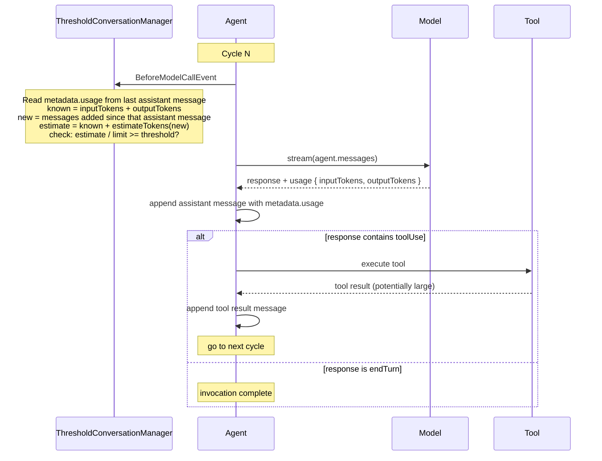

# Proactive Context Compression

**Status**: Proposed

**Date**: 2026-04-08

**Issue**: [#555: Proactive Context Compression](https://github.com/strands-agents/sdk-python/issues/555)

**Dependencies**:
- [#1295: Context Limit Property on Model](https://github.com/strands-agents/sdk-python/issues/1295) (in progress)
- [#2125: Message metadata for stateful context tracking](https://github.com/strands-agents/sdk-python/pull/2125) (merged)

**Related**:
- [#790: Track agent.messages token size](https://github.com/strands-agents/sdk-typescript/pull/790)
- [#2031: Token estimation via tiktoken](https://github.com/strands-agents/sdk-python/pull/2031)

**Scope**: TypeScript SDK. A parallel Python design will follow.

## Context

Context compression in Strands is entirely reactive. The `ConversationManager` base class hooks into `AfterModelCallEvent` and only calls `reduce()` after a `ContextWindowOverflowError` has already occurred:

```typescript
// conversation-manager.ts (current behavior)
initAgent(agent: LocalAgent): void {
  agent.addHook(AfterModelCallEvent, async (event) => {
    if (event.error instanceof ContextWindowOverflowError) {
      if (await this.reduce({ agent: event.agent, model: event.model, error: event.error })) {
        event.retry = true
      }
    }
  })
}
```

The agent operates at maximum context capacity until the model rejects the request. Three problems follow.

1. **Output token starvation.** Model context windows are shared between input and output tokens. When input tokens approach the limit, the model has insufficient capacity to generate meaningful responses, even if it does not throw an overflow error.

2. **Wasted round-trips.** The overflow-retry pattern sends a full request that the model rejects, then reduces context, then retries. The rejected request wastes latency and cost.

3. **No proactive path.** `SlidingWindowConversationManager` trims after each invocation via `AfterInvocationEvent`, but this is window-size-based, not token-aware. No mechanism exists to trigger compression based on actual input token counts relative to the model's context limit.

This design proposes proactive context compression: triggering `reduce()` before the model call when input token usage exceeds a configurable threshold.

### Terminology

- **`inputTokens`**: the number of input tokens reported by the model provider after a model call. This includes all messages, system prompt, and tool definitions sent in that request. It does not include output tokens generated by the model.
- **`outputTokens`**: the number of tokens the model generated in its response. These tokens become part of the next call's input when the assistant message is appended to `agent.messages`.
- **`contextWindowLimit`**: the maximum token capacity for a model, shared between input and output. Configured by the user or looked up from a per-provider table.
- **threshold check**: comparing estimated next-call input tokens against `contextWindowLimit`. The default threshold (0.7) implicitly reserves headroom for the model to generate output.

## Decision

We implement proactive context compression as a new `ConversationManager` that wraps an inner manager. The wrapper handles when to compress (threshold-based, before each model call). The inner manager handles how to compress (sliding window, summarization, or any custom strategy).

```typescript
export interface ThresholdConversationManagerConfig {
  /** The inner conversation manager that handles the actual compression strategy. */
  manager: ConversationManager

  /**
   * Compression threshold as a fraction of the context window (0.0 to 1.0).
   * When estimated input tokens / contextWindowLimit exceeds this value,
   * reduce() is called on the inner manager before the next model call.
   * The threshold implicitly reserves headroom for the model to generate output.
   * @default 0.7
   */
  threshold?: number
}
```

The manager delegates `reduce()` to the inner manager and registers a single `BeforeModelCallEvent` hook that runs the token counting strategy described below. No `AfterModelCallEvent` hook is needed because the manager reads token counts from message metadata rather than tracking them in internal state. This makes the manager stateless with respect to token counts, which simplifies the design and means it works correctly after session restore without any special handling.

Because `BeforeModelCallEvent` fires before every model call, including calls within a tool-use cycle, this naturally provides in-loop context management ([#298](https://github.com/strands-agents/sdk-python/issues/298)). If an agent makes five tool calls in a single invocation and context grows past the threshold between calls three and four, the manager compresses before call four.

The following diagram shows the cycle of the agent loop and where each token signal becomes available:



After the model call, the framework attaches `usage` (containing `inputTokens` and `outputTokens`) to the assistant message as metadata ([#2125](https://github.com/strands-agents/sdk-python/pull/2125)). This metadata is part of the message itself, so it survives session persistence and restore. At the start of the next cycle, the conversation manager reads it directly from `agent.messages`:

- **Known**: `inputTokens + outputTokens` from the last assistant message's metadata. This is the exact token count for everything the model saw, plus everything it generated (which is now part of the messages).
- **Unknown**: any messages appended after that assistant message, primarily tool results. These need to be estimated.

### Token Counting Strategy

The conversation manager reads `inputTokens` and `outputTokens` from the last assistant message's metadata, then estimates any new messages added after it:

```
lastAssistant = last assistant message in agent.messages
usage         = lastAssistant.metadata.usage

if usage is available:
    knownBaseline = usage.inputTokens + usage.outputTokens
    newMessages   = messages after lastAssistant (tool results, etc.)
    if no new messages:
        tokenCount = knownBaseline
    else:
        tokenCount = knownBaseline + estimateTokens(newMessages)
else:
    // Cold start or no metadata: estimate everything
    tokenCount = estimateTokens(agent.messages)

if tokenCount / contextWindowLimit >= threshold:
    compress()
```

This approach uses known values wherever possible and only estimates what it does not know. In the common case (no tool results between calls), no estimation runs at all. When tool results are appended, only those new messages are estimated, not the entire history.

Because message metadata survives session persistence ([#2125](https://github.com/strands-agents/sdk-python/pull/2125)), the known baseline is available even after session restore. The cold-start fallback (estimating everything) only applies when no assistant message with metadata exists in the history.

If `reduce()` does not bring the token count below the threshold (for example, because the inner manager cannot remove enough messages), the manager skips compression on subsequent checks until new messages change the token count. This prevents repeated futile compressions, which is especially important when the inner manager is `SummarizingConversationManager` and each `reduce()` call triggers an LLM summarization.

### SDK Changes Required

This feature depends on three changes to the SDK, in addition to the `ThresholdConversationManager` itself.

**Context window limit on Model ([#1295](https://github.com/strands-agents/sdk-python/issues/1295)).** The threshold check needs to know the model's context window size. [#1295](https://github.com/strands-agents/sdk-python/issues/1295) adds an optional `contextWindowLimit` to `BaseModelConfig` with per-provider lookup tables. Users can always override:

```typescript
const model = new BedrockModel({
  modelId: 'anthropic.claude-sonnet-4-20250514',
  contextWindowLimit: 200_000,
})
```

**Message metadata ([#2125](https://github.com/strands-agents/sdk-python/pull/2125)).** The token counting strategy reads `inputTokens` and `outputTokens` from the last assistant message's metadata. This is already merged in the Python SDK. The TypeScript SDK will need an equivalent implementation.

**Token estimation.** The `Model` base class exposes an `estimateTokens(messages: Message[])` method with a default heuristic implementation: `chars / 4` for text content and `chars / 2` for JSON content. The method is designed to be overridden. Individual model providers can supply more accurate implementations using native counting APIs. Users can also pass a custom estimator via the `tokenEstimator` config option:

```typescript
const model = new BedrockModel({
  modelId: 'anthropic.claude-sonnet-4-20250514',
  tokenEstimator: (messages) => myTiktokenCount(messages),
})
```

See [Alternative #3](#3-token-estimation-via-tokenizer) for why we chose heuristics as the default over a tokenizer dependency.

**Decouple `reduce()` from `ContextWindowOverflowError`.** The current `ConversationManagerReduceOptions` requires an `error` field. Proactive compression calls `reduce()` before an error occurs, so `error` must become optional:

```typescript
// proposed
export type ConversationManagerReduceOptions = {
  agent: LocalAgent
  model: Model
  error?: ContextWindowOverflowError
}
```

This is source-compatible. Existing `reduce()` implementations that read `error` continue to work because the field is still present on overflow-triggered calls. The two built-in managers handle `undefined` naturally: `SlidingWindowConversationManager` already checks `if (_error && ...)` before truncating tool results, and `SummarizingConversationManager` uses `error` only for error wrapping which is skipped when `undefined`.


## Developer Experience

The most common usage wraps an existing conversation manager with threshold-based compression:

```typescript
import { Agent, ThresholdConversationManager, SummarizingConversationManager } from '@strands-agents/sdk'

const agent = new Agent({
  model: new BedrockModel({
    modelId: 'anthropic.claude-sonnet-4-20250514',
    contextWindowLimit: 200_000,
  }),
  conversationManager: new ThresholdConversationManager({
    manager: new SummarizingConversationManager(),
  }),
})

for (let i = 0; i < 100; i++) {
  await agent.invoke(`Tell me about topic ${i}`)
}
```

The wrapper composes with any inner manager:

```typescript
const agent = new Agent({
  model: new BedrockModel({
    modelId: 'anthropic.claude-sonnet-4-20250514',
    contextWindowLimit: 200_000,
  }),
  conversationManager: new ThresholdConversationManager({
    manager: new SlidingWindowConversationManager({ windowSize: 50 }),
    threshold: 0.8,
  }),
})
```

Existing behavior is completely unchanged. Agents without `ThresholdConversationManager` continue to use reactive overflow recovery only:

```typescript
const agent = new Agent({
  conversationManager: new SlidingWindowConversationManager(),
})
```

## Alternatives Considered

### 1. Plugin Instead of ConversationManager

We considered implementing proactive compression as a standalone `Plugin`. A plugin would offer cleaner separation of concerns ("when to compress" in the plugin, "how to compress" in the conversation manager) and align with the Plugin architecture direction in [0001-plugins](./0001-plugins.md).

However, `ConversationManager` is the established primitive for context management. Users looking for context overflow solutions will look at conversation managers, not plugins. The existing `SlidingWindowConversationManager` already does proactive management (trimming after each invocation via `AfterInvocationEvent`), and the SDK's version supports `per_turn` for before-model-call management. Proactive compression fits naturally into this pattern. A plugin would also require exposing `conversationManager` on the `LocalAgent` interface so it could call `reduce()`, adding public API surface for an internal concern.

### 2. Adding Threshold Config Directly to Existing Managers

Issue [#555](https://github.com/strands-agents/sdk-python/issues/555) proposes adding `compressionThreshold` directly to `ConversationManager`. This is more discoverable but forces every conversation manager implementation to handle proactive logic. A wrapping manager keeps the threshold concern in one place and composes with any inner manager, including custom ones.

### 3. Token Estimation via Tokenizer

We considered using a proper tokenizer like `tiktoken` as the default for token estimation instead of the `chars / 4` and `chars / 2` heuristics. A tokenizer produces more accurate counts, especially for non-ASCII text and code. However, the estimation only applies to new messages added since the last model call (the delta). The known baseline from `inputTokens + outputTokens` handles the bulk of the count. It also adds an external dependency that must be installed separately. The heuristics are dependency-free, work identically in every language, and are accurate enough for threshold-based decisions where the default already reserves 30% headroom. Users who need higher precision can pass a custom `tokenEstimator` to their model config, and we can override `estimateTokens()` for individual providers with native counting APIs where available.

## Consequences

### What Becomes Easier

Long-running agents no longer overflow unexpectedly. Context is compressed proactively before the model rejects a request, eliminating wasted round-trips and output token starvation. The `BeforeModelCallEvent` hook fires within the agent loop, so tool-heavy workflows with many calls per invocation get in-loop compression automatically. Users get all of this by wrapping their existing conversation manager, with no changes to the inner manager's behavior. Because the manager reads token counts from message metadata rather than internal state, it works correctly after session restore with no special handling.

### What Becomes Harder or Requires Attention

Users must set `contextWindowLimit` on their model config until we ship per-provider default lookup tables. The manager depends on accurate `inputTokens` and `outputTokens` from providers. If a provider reports incorrect usage, the threshold check will be off. The `chars / 4` and `chars / 2` estimation heuristics are approximate and may over- or under-trigger for non-English text or unusual content types. Users who need higher precision can provide a custom `tokenEstimator`. Custom `ConversationManager` implementations that assume `error` is always defined in `reduce()` will need to handle the `undefined` case. The TypeScript SDK needs an equivalent of [#2125](https://github.com/strands-agents/sdk-python/pull/2125) (message metadata) before this feature can ship.

### Migration

The `error` field on `ConversationManagerReduceOptions` changes from required to optional. This is source-compatible: existing code that passes `error` continues to compile, and existing `reduce()` implementations that read `error` receive the same value on overflow-triggered calls. Custom implementations that assume `error` is always defined should add a guard. All other behavior is preserved. The new conversation manager is purely additive and opt-in.

## Willingness to Implement

Yes.
